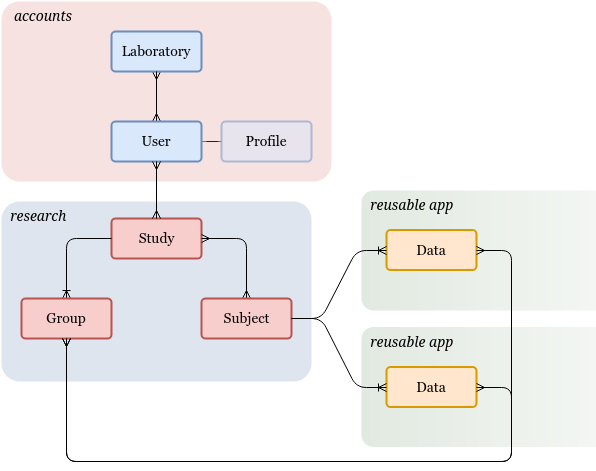

Overview
========

The project's root directory contains the :mod:`pylabber` module, which holds
the applications settings and `URL configurations`_, as well as two native
apps:

   * :mod:`~accounts`: Manages :class:`~accounts.models.user.User` (i.e.
     researcher) and :class:`~accounts.models.laboratory.Laboratory` accounts.
   * :mod:`~research`: Manages the most elementary "research entities";
     :class:`~research.models.subject.Subject`,
     :class:`~research.models.study.Study`, and
     :class:`~research.models.group.Group`.

The basic models_ detailed above are meant to be integrated with external,
`reusable apps`_, providing domain-specific data models and functionality over
them.

For a list of integrated reusable apps see :ref:`existing_apps:Existing Apps`.

.. _models:
   https://docs.djangoproject.com/en/3.0/topics/db/models/
.. _reusable apps:
   https://docs.djangoproject.com/en/3.0/intro/reusable-apps/
.. _URL configurations:
   https://docs.djangoproject.com/en/3.0/topics/http/urls/
